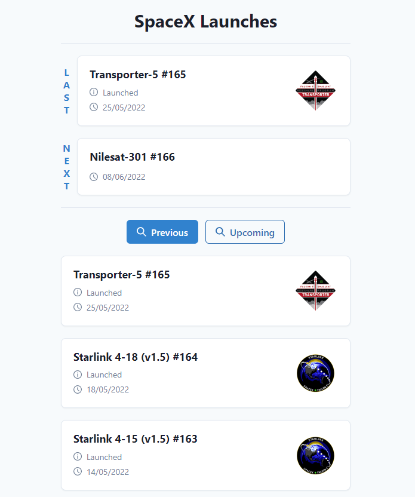
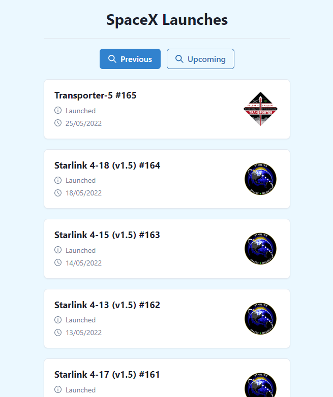
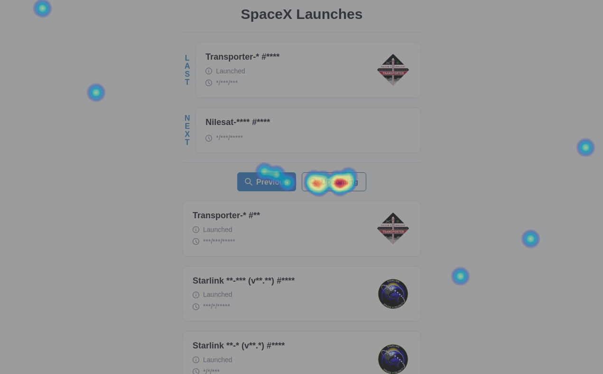
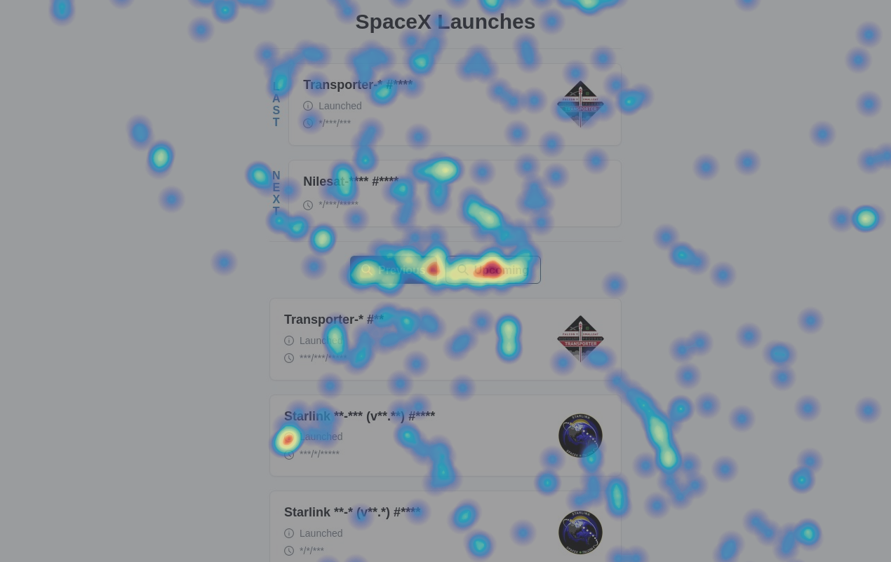

<h1 align="center">
  RD Station - SpaceX
</h1>

## 🚀 Projeto

Aplicação desenvolvida como desafio técnico da RD Station que consome a API pública de foguetes lançados da SpaceX. O back-end foi desenvolvido no formato de API REST com a linguagem Ruby e utilizando bibliotecas como Sinatra, Rack e Thin para facilitar a criação do servidor HTTP. Já o front-end foi implementado utilizando Typescript, React.js e Chakra UI.

[Clique aqui](https://rd-station-spacex-app.herokuapp.com/) para acessar a aplicação deployada no Heroku.

## 💡 Requisitos

- [x] Exibir próximo lançamento
- [x] Exibir último lançamento
- [x] Exibir todos os lançamentos futuros
- [x] Exibir todos os lançamentos passados
- [x] Implementar um teste A/B com Google Optimize
- [x] Integrar script do Hotjar
- [x] Subir [back-end](https://rd-station-spacex-api.herokuapp.com/) e [front-end](https://rd-station-spacex-app.herokuapp.com/) no Heroku

## 🎲 Executando

Para executar a aplicação em ambiente de desenvolvimento, é preciso ter no mínimo as seguintes ferramentas instaladas: [Git](https://git-scm.com), [Docker](https://docs.docker.com/engine/install/) e [Docker Compose](https://docs.docker.com/compose/install/).

```bash
# Clone o repositório
$ git clone git@github.com:viniciusmeneses/rd-station-spacex.git

# Acesse a pasta do projeto
$ cd rd-station-spacex

# Faça uma cópia arquivo de exemplo de configuração das envs (front-end)
$ cp frontend/.env.sample frontend/.env

# Execute a aplicação usando docker-compose
$ docker-compose up -d
```

Por padrão, o front-end é servido na URL http://localhost:3000 e o back-end na URL http://localhost:3001.

## 📝 Teste A/B

Foi criado um teste A/B simples utilizando a ferramenta Google Optimize com uma variante da aplicação. Nessa variante, que é aplicada em 50% dos usuários, a cor do fundo da página inicial é alterada para azul e não é exibido o próximo e o último lançamento.

<p align="center">
  
  
</p>

## 🔥 Heatmaps do Hotjar

### Cliques



### Movimentos


